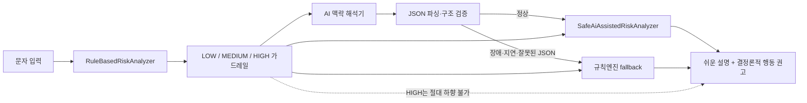

# 모두의 AI 실험실 경진대회 증빙 기록

Last updated: 2026-09-05

## 1. 목적

`AI 안심매니저`가 규칙 기반 위험 차단과 AI 맥락 해석을 결합해 시니어가 의심 문자를 이해하고 안전한 다음 행동을 선택하도록 돕는 구조를 증빙한다.

핵심 안전 원칙은 다음과 같다.

> **AI confidence ≠ user authorization**

AI는 문자의 의도·사칭 맥락과 쉬운 설명을 담당하지만, 송금·인증번호·앱 설치·원격제어 같은 고위험 행동의 허용 여부를 결정하지 않는다. 결정론적 규칙엔진이 만든 HIGH 판정과 최종 행동 권고는 AI가 낮추거나 덮어쓸 수 없다.

## 2. 확인된 플랫폼/공모전 기능

### 공개 공식 페이지에서 확인 완료

- 경진대회 주제: 모두의 AI 실험실 온라인 플랫폼을 활용한 개인·지역·사회 현안 해결 아이디어 제안 및 AI 서비스 개발
- 접수 마감: 2026-09-06 18:00
- 지원 내용: 모두의 AI 실험실 바이브코딩 토큰, 클라우드 자원, 개발지원도구
- 디지털융합플랫폼 데이터·API 지원 안내
- 모두의 AI 실험실 공식 URL: `https://aitestbed.kr`
- 경진대회 공식 URL: `https://contest.aitestbed.kr/`

공개 근거:

- `https://contest.aitestbed.kr/`
- 과학기술정보통신부 정책브리핑의 「모두의 AI 실험실」 안내

### 인증 후 실제 화면 확인이 필요한 항목 — BLOCKER

현재 작업 세션에는 `aitestbed.kr`에 로그인해 사용자의 인증 세션을 조작하거나 화면 캡처를 생성할 수 있는 브라우저 권한이 없다. 따라서 아래 항목은 추정하지 않는다.

- 프로젝트 생성 UI와 실제 프로젝트 생성 완료 여부
- 플랫폼이 현재 제공하는 **정확한 AI 모델 표시명**
- 모델 선택 방식
- 바이브코딩 토큰/프로젝트 토큰 생성 또는 할당 방식
- API endpoint 또는 SDK 제공 여부
- 배포/미리보기 기능의 존재와 정확한 명칭
- 플랫폼 실행 결과
- 플랫폼 화면 캡처

위 항목은 로그인 후 실제 UI를 확인한 뒤에만 `확인 완료`로 변경한다.

## 3. 정확한 모델/도구명

### AI 모델

- 모두의 AI 실험실 선택 모델: **미확인 — 인증 화면 확인 필요**
- 모델명을 문서나 기획서에서 임의로 추정하지 않는다.

### 현재 저장소에서 확인된 개발 도구

- Vite `^7.1.3`
- TypeScript `^5.9.2`
- Vitest `^3.2.4`
- GitHub Actions CI Node.js 22

이 도구들은 현재 프로젝트의 실제 개발/검증 도구이며, 모두의 AI 실험실이 제공하는 도구라고 주장하지 않는다.

## 4. AI와 규칙엔진의 역할 분리



코드:

- `prototype/src/ruleBasedAnalyzer.ts` — 결정론적 위험 가드레일
- `prototype/src/contestAiPrompt.ts` — 모두의 AI 실험실에서 사용할 프롬프트 계약
- `prototype/src/aiAssistedRiskAnalyzer.ts` — AI 어댑터, JSON 검증, timeout/fallback, HIGH 보호
- `prototype/src/types.ts` — AI JSON/어댑터 계약
- `prototype/tests/aiAssistedRiskAnalyzer.test.ts` — 공모전 필수 시나리오 검증

현재 플랫폼의 실제 API/SDK가 확인되지 않았기 때문에 `JsonAiMessageInterpreter`는 호출 함수를 주입받는 어댑터 경계까지만 구현했다. 플랫폼 endpoint를 추정해 하드코딩하지 않았다.

## 5. 실제 사용할 프롬프트

정본은 `prototype/src/contestAiPrompt.ts`의 `CONTEST_AI_SYSTEM_PROMPT`다.

```text
당신은 60대 이상 사용자를 위한 문자 맥락 해석기입니다.

목표:
- 입력 문자의 핵심 의도와 사칭·압박·외부링크·가족 사칭 같은 위험 맥락을 설명합니다.
- 사용자가 이해하기 쉬운 짧은 한국어를 사용합니다.
- 규칙엔진의 위험 판정은 안전 가드레일이며 절대 낮추거나 무효화하지 않습니다.

반드시 지킬 원칙:
1. AI confidence는 사용자 authorization이 아닙니다.
2. 송금·이체·인증번호 전달·앱 설치·원격제어·화면공유를 안전하다고 승인하거나 권고하지 않습니다.
3. guardrail_risk가 HIGH이면 어떤 이유로도 안전하다고 단정하지 않습니다.
4. LOW도 안전 확정을 의미하지 않습니다. 불확실성이 있으면 그대로 밝힙니다.
5. 발신자·기관의 진위를 확인하지 못했다면 확인했다고 말하지 않습니다.
6. 설명은 전체적으로 3문장 안팎의 짧고 쉬운 표현을 우선합니다.
7. 개인정보나 문자 원문을 저장·재사용한다고 가정하지 않습니다.

출력은 설명문이나 Markdown 없이 다음 JSON 객체 하나만 반환합니다.
{
  "summary": "문자의 핵심 의도를 쉬운 말로 한 문장",
  "risk_context": "주의해야 할 맥락을 쉬운 말로 한 문장",
  "safe_next_action": "지금 할 수 있는 안전한 다음 행동 한 문장",
  "uncertainty": "확인되지 않은 점 또는 불확실성 한 문장"
}
```

입력에는 문자 원문과 함께 규칙엔진의 `guardrail_risk`, `guardrail_signals`를 전달하도록 설계했다. 실제 플랫폼 실행 전에는 이 프롬프트를 **실행 완료 프롬프트**라고 주장하지 않는다.

## 6. 입력·출력 예시

아래 결과는 플랫폼 실측 결과가 아니라 코드 계약 및 테스트에서 사용하는 **검증용 fixture**다. 실제 제출 증빙에는 로그인한 모두의 AI 실험실에서 같은 입력을 실행한 원본 출력으로 교체해야 한다.

### 예시 A — 일반 일정 안내

입력:

```text
내일 오후 2시에 주민센터 프로그램이 있습니다.
```

fixture JSON:

```json
{
  "summary": "일정이나 안내 내용을 전달하는 문자로 보여요.",
  "risk_context": "지금 문장만으로는 돈이나 개인정보를 요구하는 맥락이 뚜렷하지 않아요.",
  "safe_next_action": "내용만 확인하고 추가 행동 요구가 생기면 다시 확인하세요.",
  "uncertainty": "발신자 자체가 진짜인지는 이 분석만으로 확인할 수 없어요."
}
```

규칙엔진 결과: `LOW` — 단, 안전 확정 아님.

### 예시 B — 택배 외부 링크

입력:

```text
배송지를 확인해 주세요 https://delivery.example/parcel
```

fixture JSON:

```json
{
  "summary": "택배 확인을 위해 외부 링크를 누르게 하는 문자예요.",
  "risk_context": "외부 링크는 실제 택배사 주소인지 별도 확인이 필요해요.",
  "safe_next_action": "문자 속 링크 대신 택배사 공식 앱이나 홈페이지에서 직접 확인하세요.",
  "uncertainty": "이 주소가 실제 택배사 주소인지는 현재 확인되지 않았어요."
}
```

규칙엔진 결과: `MEDIUM`.

### 예시 C — 검찰 사칭 + 안전계좌 이체

입력:

```text
검찰입니다. 범죄 연루 확인을 위해 지금 안전계좌로 전액 이체하세요.
```

AI가 어떤 설명을 반환하더라도 규칙엔진 결과는 `HIGH`이며 다음 정지 메시지가 유지된다.

```text
지금은 행동하지 않는 것이 안전해요.
```

최종 행동 권고 역시 AI의 `safe_next_action`으로 대체하지 않는다.

## 7. 필수 검증 시나리오

`prototype/tests/aiAssistedRiskAnalyzer.test.ts`에 다음을 자동 테스트로 추가했다.

1. 일반 일정 안내 → LOW, 안전 확정 아님
2. 택배 외부 링크 → MEDIUM 확인 필요
3. 검찰 사칭 + 안전계좌 이체 → HIGH 유지, AI가 안전하다고 말해도 하향 불가
4. 인증번호 요구 → HIGH 유지
5. 가족 새 번호 사칭 가능성 → MEDIUM 확인 필요
6. 잘못된 JSON → 규칙엔진 fallback
7. 모델 장애 → 규칙엔진 fallback

## 8. 화면 캡처 증빙 경로

실제 로그인 후 다음 파일명을 사용한다. 현재는 **실제 파일이 없으며 증빙 완료로 계산하지 않는다.**

- `docs/contest/evidence/01-project-created.png` — `AI 안심매니저` 프로젝트 생성 화면
- `docs/contest/evidence/02-prompt-model-settings.png` — 정확한 모델 표시명 + 프롬프트/설정 화면
- `docs/contest/evidence/03-execution-result.png` — 개인정보 없는 입력과 JSON 실행 결과

가능하면 추가:

- `docs/contest/evidence/04-preview-or-deploy.png` — 플랫폼에서 실제로 확인된 경우에만 미리보기/배포 화면

## 9. 개인정보·보안

- 실제 문자 원문을 저장소에 커밋하지 않는다.
- 플랫폼 실행 캡처에는 전화번호, 이름, 인증번호, 실주소 등 개인정보를 사용하지 않는다.
- API 키/토큰은 저장소, 클라이언트 번들, 로그에 기록하지 않는다.
- 실제 플랫폼 연동 시 키가 필요한 경우 서버 측 secret 또는 플랫폼 secret 저장소가 **실제로 제공되는지 확인한 뒤** 사용한다.

## 10. 공식 데이터 연계 상태

KISA/보호나라 관련 공식 공개 데이터 검증 인프라는 별도로 존재하지만, 현재 모두의 AI 실험실 연계나 실시간 KISA API 연동 완료를 주장하지 않는다.

- 실제 공개 API 존재/약관/인증 방식이 확인되지 않은 기능은 `candidate` 또는 후속 단계로 유지
- 공식 목록 미일치도 안전 판정으로 사용하지 않음

## 11. 현재 blocker / 제출 전 수동 완료 체크

- [ ] `aitestbed.kr` 로그인
- [ ] `AI 안심매니저` 프로젝트 실제 생성
- [ ] 정확한 모델 표시명 기록
- [ ] 토큰/프로젝트 생성 또는 할당 방식 기록
- [ ] 위 프롬프트 실제 실행
- [ ] 최소 입력 3개 원본 JSON 출력 기록
- [ ] 캡처 3개 이상 저장
- [ ] 미리보기/배포 기능 실제 존재 여부 확인
- [ ] 본 문서의 `미확인` 항목을 실제 값으로 갱신

이 체크가 끝나기 전까지는 **플랫폼 사용 증거 최소 3개** 완료 조건을 충족했다고 주장하지 않는다.
